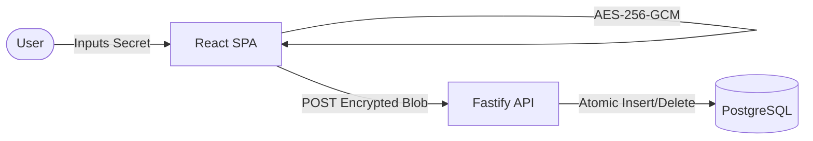

# OneTime Secure 🔒

## Overview
OneTime Secure is a self-hosted, zero-knowledge platform that allows engineering and operations teams to securely share sensitive information (such as passwords, API keys, or private notes) using single-use, self-destructing links.

## Problem
Sharing credentials over Slack, Microsoft Teams, or email is highly insecure. These platforms keep permanent logs of the text. Once you hit send, that credential lives on their servers indefinitely, waiting to be exposed in a future data breach.

## Solution
OneTime Secure ensures that sensitive data exists only temporarily and can only be viewed exactly once. It utilizes **Zero-Knowledge Encryption** in the browser, meaning the backend server never sees the plaintext data. Additionally, it uses **Atomic Database Locks** to ensure the encrypted blob is destroyed instantly upon the first viewing attempt, completely eliminating race conditions.

## Key Features
- **Zero-Knowledge Architecture:** AES-256-GCM encryption happens entirely in the browser.
- **URL Fragment Protection:** The decryption key is sent in the URL hash (`#`), which modern browsers strictly keep local and never transmit to the server.
- **Atomic Deletion:** Strict PostgreSQL `UPDATE ... RETURNING` locks prevent simultaneous reads.
- **Premium UI:** Fully responsive, dark-mode SaaS dashboard with glassmorphism.
- **Self-Hosted:** Deployable in seconds via Docker Compose.

## Target Users
Developers, DevOps Engineers, IT Administrators, and anyone who needs a compliant and secure way to exchange sensitive information without relying on third-party SaaS vendors.

## Screenshots
*(Add your screenshots here)*
- `/docs/screenshots/create_secret.png`
- `/docs/screenshots/view_secret.png`

## User Flow
1. **User** types a secret into the dashboard.
2. **Browser** encrypts it and sends the ciphertext to the API.
3. **API** stores the ciphertext in PostgreSQL and returns a unique Token.
4. **Browser** generates a shareable URL containing the Token and the Decryption Key.
5. **Recipient** opens the URL. 
6. **API** fetches and atomically destroys the ciphertext in the database.
7. **Browser** decrypts the ciphertext locally and displays the plaintext to the recipient.

## Technology Stack
- **Frontend:** React (Vite), Tailwind CSS v4, Lucide React
- **Backend:** Node.js, Fastify, TypeScript
- **Database:** PostgreSQL (for ACID guarantees)
- **Cryptography:** Web Crypto API (`AES-256-GCM`)
- **Deployment:** Docker, Docker Compose

## Architecture


## Getting Started

### Prerequisites
- Docker and Docker Compose installed on your machine.

### Installation
1. Clone the repository:
   ```bash
   git clone https://github.com/GhadiSachin/OneTimeSecure.git
   cd OneTimeSecure
   ```
2. Configure environment variables (do not use real secrets in development):
   ```bash
   cp .env.example .env
   ```
3. Run the application stack:
   ```bash
   docker-compose up --build -d
   ```
4. Open your browser and navigate to `http://localhost:8080`.

## Environment Variables
The application requires database configuration. Please refer to `.env.example` for the required keys. Never commit your actual `.env` file!

## Project Structure
```text
OneTimeSecure/
├── apps/
│   ├── api/             # Fastify Backend
│   └── web/             # React Frontend
├── packages/
│   ├── crypto/          # Shared AES-GCM logic
│   └── shared/          # Shared types
├── docs/                # Product Documentation & Workflow diagrams
├── infra/               # Docker configurations
├── .env.example
├── .gitignore
├── LICENSE
└── README.md
```

## Documentation
For an extensive breakdown of the system, including user personas, business rules, API documentation, and testing procedures, please view the [Full Product Documentation](docs/PRODUCT_DOCUMENTATION.md).

## Security
**Important:** Secrets should be configured through environment variables and should never be committed to the repository. The backend is explicitly designed to have zero knowledge of the plaintext secrets it hosts.

## Future Improvements
- Redis-backed IP Rate Limiting for API abuse prevention.
- Admin Authentication dashboard.
- Configurable expiration times for unread secrets.

## License
This project is licensed under the MIT License - see the [LICENSE](LICENSE) file for details.

## Contact
**Sachin Ghadi** - [GitHub Profile](https://github.com/GhadiSachin)
