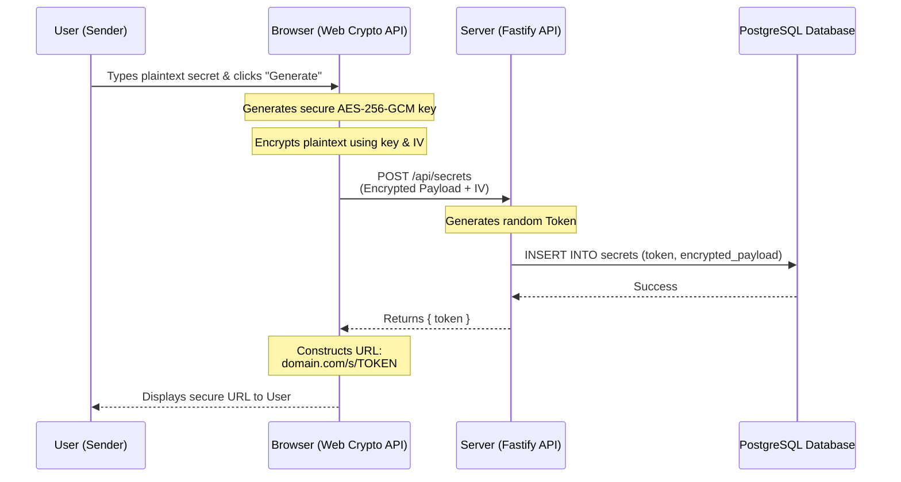
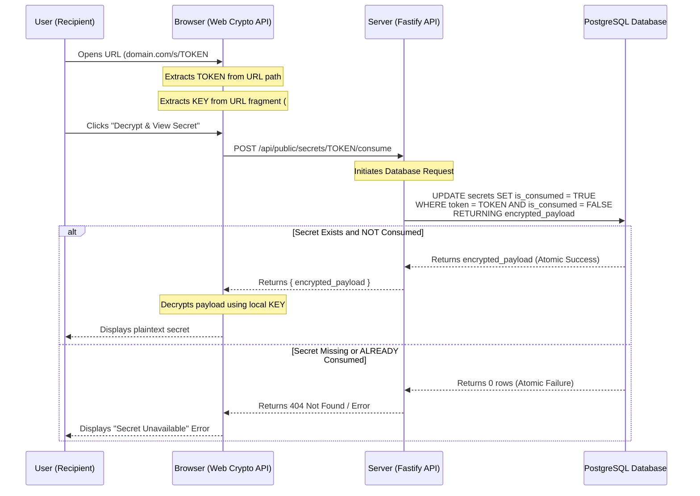

# OneTime Secure: System Workflow

This document visually maps out the step-by-step workflow for the two primary operations in OneTime Secure: **Creating a Secret** and **Consuming a Secret**.

## 1. Secret Creation Workflow

This flow describes how a secret is securely encrypted in the browser before any data reaches the server.

## 2. Secret Consumption Workflow

This flow demonstrates the atomic retrieval process and how the secret is decrypted locally, maintaining the zero-knowledge guarantee.

## Key Workflow Concepts

1. **Zero-Knowledge Encryption:** The `KEY` is never transmitted to the `Server`. It travels in the URL fragment (`#KEY`), which modern browsers strictly keep local and do not include in HTTP network requests.
2. **Atomic Row Locks:** The database uses a single `UPDATE ... RETURNING` query. This ensures that even if an attacker sends 100 simultaneous network requests attempting to read the secret, PostgreSQL will lock the row, process the first request, set `is_consumed = TRUE`, and instantly reject the remaining 99 requests.
